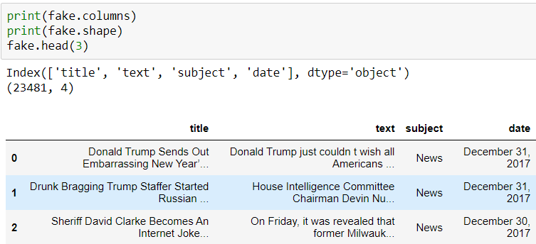
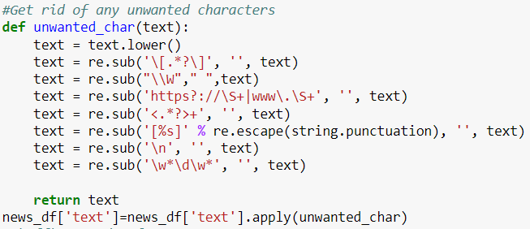
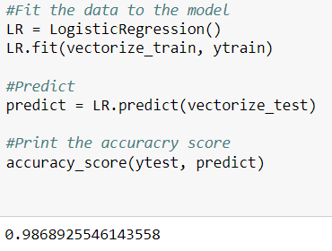
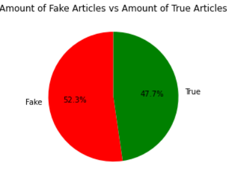
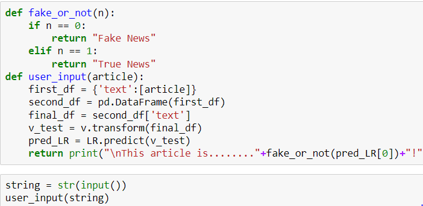
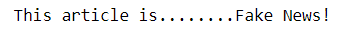

# Fake-News-Detection-ML

## Introduction
The objective of this project was to practice using all of the skills and tools that we have learned over the past semester and implement them into a functional program. I decided that a great way to accomplish this would be to create a fake news detection program using machine learning. This project has been done many times, but for good reason. It showcases all that we have learned so far in our class, as well as using some libraries and techniques that were not fully covered in our discussions. This project provided a great challenge while also helping me to compile my datascience skills together and create something useful.

I decided to do a fake news detection program while reading an article on what makes a good data science project. This project is great for machine learning, as it is boolean based (True or Fake) and has over 40,000 articles to work with.

## Selection of Data
For the data, I used a dataset from Kaggle (https://www.kaggle.com/clmentbisaillon/fake-and-real-news-dataset). It contains two CSV files, Fake and True. These datasets are labeled with a title (title), the entire text in the article (text), the date (date), and the source/subject of the article (subject). Each dataset also contained over 20,000 articles each. 

Heres an example of the fake news dataset:

Some of these columns (date, title) were dropped because they were not used in any part of the program.

There had to be a lot of cleaning up of the data for this specific project because the articles all contain phrases that would mess up the accuracy of our program. To do this, I implemented a method that cycles through the article and removes unwanted characters.

I also merged the two dataframes into one, and added another column to that merged dataframe called 'Indicator' which hold a 1 or 0 that represent true and false respectively. 

## Methods
Tools used:
  - NumPy, Scikit-learn, Pandas, re, nltk, matplotlib
  - Jupyter Notebook as IDE
Scikit:
  - Logistic Regression for ML
  - Accuracy score, classification report, TfidVectorizer
  - Wordcloud for visualization
## Results
The Logistic Regression worked great for the fake news detection program, and achieved a 99% accuracy score.

Our LR model worked just as expected, as LR models work great with booleans.
 

After the visualizations , we arrive at the user input portion.

## Discussion
While completing this project, the skills I learned earlier in the semester were placed firmly back into my memory, and the topics that were fresh in my mind before starting this project are now even more refined. The choice to go with Logistic Regression was a good choice, as it achieved a 99% accuracy score every time. 

 The user input section is very simple, but it works for most political articles. In the future, I would love to implement a way for a user to type in the web address of an article instead of requiring them to copy and paste the entire string. Nevertheless, the user input program works great for how simple it is!
